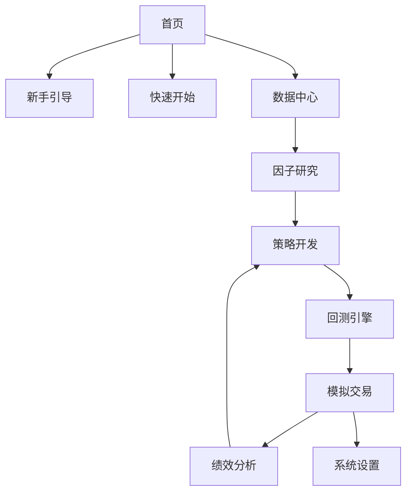

## 1. 产品概述

专业级量化投研与交易平台，对标聚宽JoinQuant、米筐RiceQuant等专业平台，为A股个人/机构投资者提供一站式量化投研与模拟交易服务。

* 解决历史版本体验与逻辑缺陷，实现全链路闭环、专业合规、开箱即用的量化投研平台

* 面向A股市场，提供从数据接入到绩效复盘的完整量化投研流程

## 2. 核心功能

### 2.1 用户角色

| 角色   | 注册方式 | 核心权限                           |
| ---- | ---- | ------------------------------ |
| 普通用户 | 邮箱注册 | 使用所有基本功能，包括数据查询、因子分析、策略回测、模拟交易 |
| 专业用户 | 高级认证 | 额外支持自定义因子、高级策略编辑、API接入等功能      |

### 2.2 功能模块

1. **首页**：平台概览、新手引导、快速开始、我的收藏
2. **数据中心**：行情数据、基本面数据、资金流数据、行业数据、新闻舆情、数据管理、API接入
3. **因子研究**：因子库、因子计算、因子预处理、因子有效性分析、因子筛选、因子可视化、自定义因子
4. **策略开发**：策略模板库、策略编辑器、参数配置、策略调试、自定义策略
5. **回测引擎**：回测任务管理、回测执行、回测报告、参数优化、敏感性分析、过拟合检验
6. **模拟交易**：模拟账户总览、交易下单、持仓管理、委托记录、成交明细、交割单、风险控制、条件单管理
7. **绩效分析**：收益分析、风险分析、归因分析、持仓分析、交易行为分析、报告导出
8. **系统设置**：账户设置、API配置、行情设置、交易规则设置、数据缓存、帮助中心

### 2.3 页面详情

| 页面名称 | 模块名称    | 功能描述                                    |
| ---- | ------- | --------------------------------------- |
| 首页   | 平台概览    | 展示账户信息、最近回测任务、模拟账户盈亏、核心数据概览卡片           |
| 首页   | 新手引导    | 首次进入平台自动弹出分步式引导，清晰讲解平台核心流程              |
| 首页   | 快速开始    | 内置3套开箱即用的一键运行demo，无需任何配置，点击即可跑完全流程      |
| 数据中心 | 行情数据    | 提供沪深全市场股票、核心指数的历史与实时行情数据，支持K线图展示        |
| 数据中心 | 基本面数据   | 提供PE/PB/ROE/净利润/营收等基本面指标数据，支持多维度查询与对比   |
| 因子研究 | 因子库     | 内置≥30个标准化因子，覆盖估值、盈利、成长、动量等9大类           |
| 因子研究 | 因子有效性分析 | 计算IC值、ICIR值、Rank IC等核心指标，进行因子分层回测、单调性检验 |
| 因子研究 | 因子筛选    | 支持用户设置筛选阈值，一键自动筛选有效因子，输出因子筛选报告          |
| 策略开发 | 策略模板库   | 内置≥5套经典可直接运行的策略模板，包含多因子选股、动量反转等         |
| 策略开发 | 策略编辑器   | 支持可视化参数配置，同时支持专业用户通过Python代码编写自定义策略     |
| 回测引擎 | 回测执行    | 支持设置回测时间区间、初始资金、仓位管理规则、调仓周期，一键启动回测      |
| 回测引擎 | 回测报告    | 输出专业级回测报告，包含年化收益率、夏普比率、最大回撤等核心指标        |
| 模拟交易 | 交易下单    | 支持标的搜索、买卖方向选择、委托类型选择、委托价格/数量输入、仓位比例快捷选择 |
| 模拟交易 | 持仓管理    | 实时展示持仓标的、持仓数量、可用数量、成本价、现价、浮动盈亏等信息       |
| 模拟交易 | 条件单管理   | 支持止盈止损单、价格条件单、时间条件单，触发后自动执行委托           |
| 绩效分析 | 收益分析    | 提供累计收益、年化收益、月度/年度收益、收益分布、基准对标分析         |
| 绩效分析 | 风险分析    | 提供最大回撤、波动率、下行风险、夏普比率、卡玛比率等风险指标          |

## 3. 核心流程

用户核心操作流程：

1. 新用户进入平台，通过新手引导了解平台功能
2. 选择快速开始demo，体验完整量化投研流程
3. 进入数据中心，查询和分析金融数据
4. 在因子研究模块，进行因子分析和筛选
5. 在策略开发模块，选择或创建交易策略
6. 使用回测引擎对策略进行回测和优化
7. 在模拟交易模块，执行模拟交易操作
8. 通过绩效分析模块，评估策略和交易表现

## 4. 用户界面设计

### 4.1 设计风格

* 主色调：专业金融蓝 `#165DFF`

* 辅助色：低饱和度合规配色

* 中性色：白-灰-黑12阶梯度

* 按钮风格：圆角统一（4px/8px），卡片化布局，阴影层级清晰

* 字体：无衬线字体，响应式字体大小

* 布局风格：卡片化布局，留白充足，符合金融终端专业调性

* 图标风格：简洁、专业的线性图标

### 4.2 页面设计概览

| 页面名称 | 模块名称  | UI元素                   |
| ---- | ----- | ---------------------- |
| 首页   | 平台概览  | 卡片式布局，数据可视化图表，响应式网格系统  |
| 数据中心 | 行情数据  | K线图，数据表格，筛选器，导出按钮      |
| 因子研究 | 因子分析  | 热力图，时间序列图，分层收益图，参数配置面板 |
| 策略开发 | 策略编辑器 | 代码编辑器，参数配置表单，调试按钮      |
| 回测引擎 | 回测报告  | 收益曲线，回撤曲线，热力图，数据表格     |
| 模拟交易 | 交易下单  | 下单表单，盘口行情，持仓概览，委托记录    |
| 绩效分析 | 收益分析  | 收益曲线，月度收益热力图，数据表格，导出按钮 |

### 4.3 响应式设计

* 断点体系：严格适配4个核心断点

  * 移动端：<768px，侧边栏折叠为抽屉式导航，单列布局

  * 平板端：768px-1200px，侧边栏可折叠/展开，双列栅格布局

  * 桌面端：1200px-1920px，侧边栏固定展开，12列栅格布局

  * 大屏端：>1920px，内容区最大宽度约束，居中布局

* 元素适配：文本采用rem相对单位，图表宽度100%自适应容器，容器采用Flex/Grid弹性布局

* 溢出处理：仅允许内容区纵向滚动，禁止横向全局滚动

### 4.4 交互设计

* 加载态：所有异步操作显示加载指示器

* 错误态：清晰的错误提示和处理建议

* 空数据态：友好的空数据提示和引导操作

* 操作反馈：所有用户操作提供明确的视觉反馈

* 导航体系：侧边栏主导航+顶部全局导航+面包

