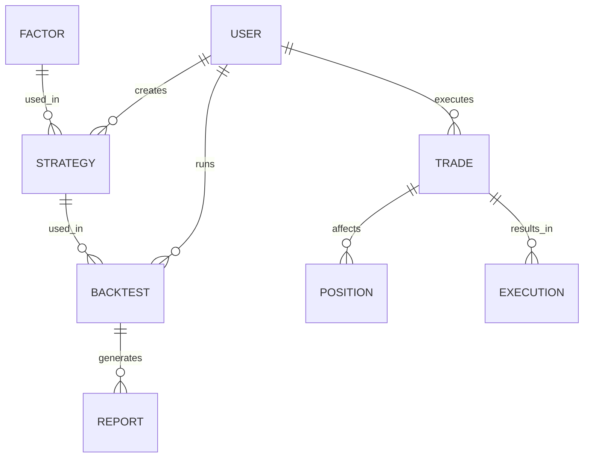

## 1. 架构设计
```mermaid
diagram TD
    Frontend[前端应用] --> Backend[模拟后端服务]
    Frontend --> LocalStorage[本地存储]
    Backend --> MockData[模拟数据]
    
    subgraph Frontend
        Vue3[Vue3 + TypeScript]
        ElementPlus[Element Plus]
        ECharts[ECharts]
        VueRouter[Vue Router]
        Pinia[Pinia]
        Components[组件库]
        Views[页面组件]
    end
    
    subgraph Backend
        Express[Express.js]
        API[RESTful API]
        DataServices[数据服务]
        BacktestEngine[回测引擎]
        TradingEngine[模拟交易引擎]
    end
```

## 2. 技术描述
- 前端：Vue3 + TypeScript + Element Plus + ECharts + Vue Router + Pinia
- 初始化工具：Vite
- 后端：Express.js（模拟后端服务）
- 数据：模拟API + 本地存储
- 构建工具：Vite
- 包管理器：npm

## 3. 路由定义
| 路由 | 用途 |
|-------|---------|
| / | 首页 |
| /home/overview | 平台概览 |
| /home/guide | 新手引导 |
| /home/quickstart | 快速开始 |
| /home/favorites | 我的收藏 |
| /data/market | 行情数据 |
| /data/fundamental | 基本面数据 |
| /data/capital | 资金流数据 |
| /data/industry | 行业数据 |
| /data/news | 新闻舆情 |
| /data/management | 数据管理 |
| /data/api | API接入 |
| /factor/library | 因子库 |
| /factor/calculation | 因子计算 |
| /factor/preprocessing | 因子预处理 |
| /factor/analysis | 因子有效性分析 |
| /factor/selection | 因子筛选 |
| /factor/visualization | 因子可视化 |
| /factor/custom | 自定义因子 |
| /strategy/templates | 策略模板库 |
| /strategy/editor | 策略编辑器 |
| /strategy/parameters | 参数配置 |
| /strategy/debug | 策略调试 |
| /strategy/custom | 自定义策略 |
| /backtest/tasks | 回测任务管理 |
| /backtest/execution | 回测执行 |
| /backtest/report | 回测报告 |
| /backtest/optimization | 参数优化 |
| /backtest/sensitivity | 敏感性分析 |
| /backtest/overfitting | 过拟合检验 |
| /trading/overview | 模拟账户总览 |
| /trading/order | 交易下单 |
| /trading/position | 持仓管理 |
| /trading/entrust | 委托记录 |
| /trading/execution | 成交明细 |
| /trading/settlement | 交割单 |
| /trading/risk | 风险控制 |
| /trading/condition | 条件单管理 |
| /performance/return | 收益分析 |
| /performance/risk | 风险分析 |
| /performance/attribution | 归因分析 |
| /performance/position | 持仓分析 |
| /performance/behavior | 交易行为分析 |
| /performance/export | 报告导出 |
| /settings/account | 账户设置 |
| /settings/api | API配置 |
| /settings/market | 行情设置 |
| /settings/rules | 交易规则设置 |
| /settings/cache | 数据缓存 |
| /settings/help | 帮助中心 |

## 4. API定义

### 4.1 数据中心API
| API路径 | 方法 | 功能描述 | 请求参数 | 响应格式 |
|---------|------|----------|----------|----------|
| /api/data/market | GET | 获取行情数据 | symbol, startDate, endDate, frequency | {code: 200, data: [...], message: "success"} |
| /api/data/fundamental | GET | 获取基本面数据 | symbol, startDate, endDate, indicators | {code: 200, data: [...], message: "success"} |
| /api/data/capital | GET | 获取资金流数据 | symbol, startDate, endDate | {code: 200, data: [...], message: "success"} |
| /api/data/industry | GET | 获取行业数据 | industryCode, startDate, endDate | {code: 200, data: [...], message: "success"} |
| /api/data/news | GET | 获取新闻舆情 | symbol, startDate, endDate | {code: 200, data: [...], message: "success"} |

### 4.2 因子研究API
| API路径 | 方法 | 功能描述 | 请求参数 | 响应格式 |
|---------|------|----------|----------|----------|
| /api/factor/library | GET | 获取因子库 | category | {code: 200, data: [...], message: "success"} |
| /api/factor/calculate | POST | 计算因子值 | symbols, factors, startDate, endDate | {code: 200, data: [...], message: "success"} |
| /api/factor/preprocess | POST | 因子预处理 | factorData, method | {code: 200, data: [...], message: "success"} |
| /api/factor/analyze | POST | 因子有效性分析 | factorData, parameters | {code: 200, data: {...}, message: "success"} |
| /api/factor/select | POST | 因子筛选 | factorData, thresholds | {code: 200, data: [...], message: "success"} |

### 4.3 策略开发API
| API路径 | 方法 | 功能描述 | 请求参数 | 响应格式 |
|---------|------|----------|----------|----------|
| /api/strategy/templates | GET | 获取策略模板 | category | {code: 200, data: [...], message: "success"} |
| /api/strategy/create | POST | 创建策略 | name, type, parameters, code | {code: 200, data: {...}, message: "success"} |
| /api/strategy/update | PUT | 更新策略 | id, name, parameters, code | {code: 200, data: {...}, message: "success"} |
| /api/strategy/delete | DELETE | 删除策略 | id | {code: 200, message: "success"} |

### 4.4 回测引擎API
| API路径 | 方法 | 功能描述 | 请求参数 | 响应格式 |
|---------|------|----------|----------|----------|
| /api/backtest/run | POST | 运行回测 | strategyId, startDate, endDate, initialCapital, parameters | {code: 200, data: {...}, message: "success"} |
| /api/backtest/report | GET | 获取回测报告 | backtestId | {code: 200, data: {...}, message: "success"} |
| /api/backtest/optimize | POST | 参数优化 | strategyId, startDate, endDate, initialCapital, paramRanges | {code: 200, data: {...}, message: "success"} |

### 4.5 模拟交易API
| API路径 | 方法 | 功能描述 | 请求参数 | 响应格式 |
|---------|------|----------|----------|----------|
| /api/trading/account | GET | 获取账户信息 | | {code: 200, data: {...}, message: "success"} |
| /api/trading/order | POST | 下单 | symbol, direction, type, price, quantity | {code: 200, data: {...}, message: "success"} |
| /api/trading/cancel | POST | 撤单 | orderId | {code: 200, data: {...}, message: "success"} |
| /api/trading/positions | GET | 获取持仓 | | {code: 200, data: [...], message: "success"} |
| /api/trading/orders | GET | 获取委托记录 | status, startDate, endDate | {code: 200, data: [...], message: "success"} |
| /api/trading/executions | GET | 获取成交明细 | startDate, endDate | {code: 200, data: [...], message: "success"} |
| /api/trading/condition | POST | 创建条件单 | symbol, direction, type, price, quantity, condition | {code: 200, data: {...}, message: "success"} |

### 4.6 绩效分析API
| API路径 | 方法 | 功能描述 | 请求参数 | 响应格式 |
|---------|------|----------|----------|----------|
| /api/performance/analyze | POST | 绩效分析 | startDate, endDate, accountId | {code: 200, data: {...}, message: "success"} |
| /api/performance/export | POST | 导出报告 | reportId, format | {code: 200, data: {...}, message: "success"} |

## 5. 服务器架构图
```mermaid
diagram TD
    Client[前端请求] --> Router[Express路由]
    Router --> Controller[API控制器]
    Controller --> Service[业务服务]
    Service --> DataAccess[数据访问]
    DataAccess --> MockData[模拟数据]
    Service --> BacktestEngine[回测引擎]
    Service --> TradingEngine[模拟交易引擎]
```

## 6. 数据模型

### 6.1 数据模型定义


### 6.2 数据定义

#### 6.2.1 用户数据
```typescript
interface User {
  id: string;
  username: string;
  email: string;
  role: 'normal' | 'professional';
  createdAt: string;
  lastLogin: string;
}
```

#### 6.2.2 策略数据
```typescript
interface Strategy {
  id: string;
  userId: string;
  name: string;
  type: string;
  parameters: Record<string, any>;
  code?: string;
  createdAt: string;
  updatedAt: string;
}
```

#### 6.2.3 回测数据
```typescript
interface Backtest {
  id: string;
  strategyId: string;
  startDate: string;
  endDate: string;
  initialCapital: number;
  parameters: Record<string, any>;
  status: 'pending' | 'running' | 'completed' | 'failed';
  createdAt: string;
  completedAt?: string;
}
```

#### 6.2.4 回测报告数据
```typescript
interface BacktestReport {
  id: string;
  backtestId: string;
  metrics: {
    annualReturn: number;
    totalReturn: number;
    sharpeRatio: number;
    maxDrawdown: number;
    winRate: number;
    profitFactor: number;
    turnover: number;
  };
  equityCurve: Array<{ date: string; value: number }>;
  drawdownCurve: Array<{ date: string; value: number }>;
  monthlyReturns: Array<{ month: string; return: number }>;
  trades: Array<{
    date: string;
    symbol: string;
    direction: 'buy' | 'sell';
    price: number;
    quantity: number;
    profit: number;
  }>;
  createdAt: string;
}
```

#### 6.2.5 交易数据
```typescript
interface Trade {
  id: string;
  userId: string;
  symbol: string;
  direction: 'buy' | 'sell';
  type: 'limit' | 'market';
  price: number;
  quantity: number;
  status: 'pending' | 'filled' | 'cancelled';
  createdAt: string;
  filledAt?: string;
  filledPrice?: number;
  filledQuantity?: number;
}
```

#### 6.2.6 持仓数据
```typescript
interface Position {
  id: string;
  userId: string;
  symbol: string;
  quantity: number;
  availableQuantity: number;
  costPrice: number;
  currentPrice: number;
  marketValue: number;
  unrealizedPnl: number;
  updatedAt: string;
}
```

#### 6.2.7 因子数据
```typescript
interface Factor {
  id: string;
  name: string;
  category: string;
  description: string;
  formula: string;
  parameters: Record<string, any>;
  createdAt: string;
}
```

#### 6.2.8 因子分析数据
```typescript
interface FactorAnalysis {
  id: string;
  factorId: string;
  startDate: string;
  endDate: string;
  metrics: {
    ic: number;
    icir: number;
    rankIc: number;
    annualReturn: number;
    sharpeRatio: number;
    maxDrawdown: number;
    winRate: number;
    tTest: number;
  };
 分层收益: Array<{ layer: number; return: number }>;
  icTimeSeries: Array<{ date: string; value: number }>;
  createdAt: string;
}
```